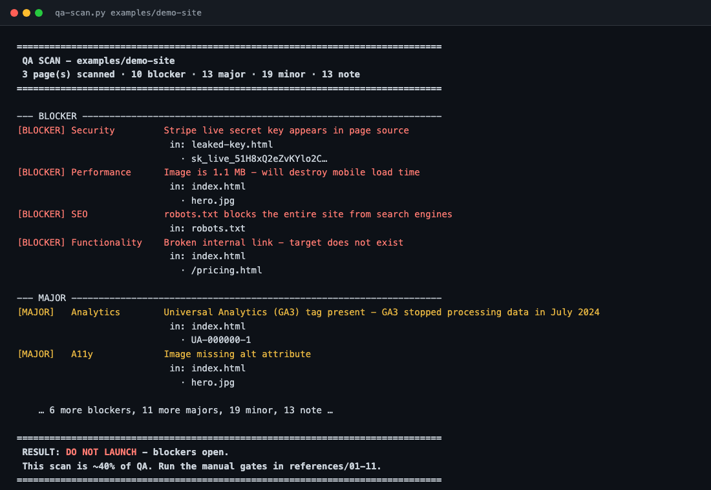

# web-qa

**A meticulous end-to-end QA process for shipping websites - as a Claude skill, plus a zero-dependency scanner you can run anywhere.**

[](https://github.com/brittanyslay/web-qa/actions/workflows/ci.yml)
[](LICENSE.md)




*An actual terminal run, not a mockup - `python3 scripts/qa-scan.py examples/demo-site` produces exactly this.*

The difference between an amateur site and a professional one usually isn't the build. It's what got caught before the client saw it. This is that catch, written down.

```
==============================================================================
 QA SCAN - ./my-site
 3 page(s) scanned · 10 blocker · 13 major · 19 minor · 13 note
==============================================================================

--- BLOCKER ------------------------------------------------------------------
[BLOCKER] Functionality    Broken internal link - target does not exist
                            in: index.html
                              · /pricing.html
[BLOCKER] Performance      Image is 1.1 MB - will destroy mobile load time
                            in: index.html
                              · hero.jpg
[BLOCKER] Security         Stripe live secret key appears in page source
                            in: leaked-key.html
                              · sk_live_51H8xQ2eZvKYlo2C…
[BLOCKER] SEO              robots.txt blocks the entire site from search engines
[BLOCKER] Responsive       Missing viewport meta - site will not render on mobile
```

*Real output from the bundled demo site - a severity-graded punch list, not a vague "looks good."*

## What it does

- **11 gate checklists** covering functionality, forms, responsive, accessibility, performance, content, SEO, analytics, security, deploy, and post-launch.
- **`qa-scan.py`** - a scanner that catches the mechanical ~40%: broken links, missing images, hardcoded secrets, `noindex` shipped to production, unlabelled inputs, oversized images, dev URLs left in the markup, and stale or double-loaded analytics tags.
- **Severity grading** so "ready to launch" means something specific - 🔴 blocker · 🟠 major · 🟡 minor · 🔵 note, and you don't launch with an open blocker.
- **Exit code is non-zero when blockers exist**, so it drops straight into CI.

## Install

As a Claude Code skill:

```bash
git clone https://github.com/brittanyslay/web-qa.git ~/.claude/skills/web-qa
```

Or just clone it and run the scanner directly. It needs nothing beyond Python 3.9+ and installs nothing:

```bash
git clone https://github.com/brittanyslay/web-qa.git
python3 web-qa/scripts/qa-scan.py ./my-site            # a local build directory
python3 web-qa/scripts/qa-scan.py https://example.com  # a live site
```

## Example prompts

Natural things to ask Claude once the skill is installed:

- `QA this site before I launch`
- `run a pre-launch check on my build`
- `scan https://example.com for broken links and SEO issues`
- `is this site ready to ship`
- `find hardcoded secrets and noindex tags before I deploy`
- `why does my site look broken on mobile`
- `check my site after deploy - did anything regress`
- `punch list this build and grade everything by severity`
- `run the pre-launch checklist and tell me what's a blocker`
- `review my site before I hand it to the client`

It runs the scanner, works the manual gates, grades findings by severity, and writes the report.

## What's inside

The scanner checks the mechanical layer:

| Area | Examples |
|---|---|
| **Links** | broken internal links, dead anchors, missing image/CSS/JS files, `http://` links, `target="_blank"` without `rel="noopener"`, vague link text |
| **Security** | Stripe/AWS/GitHub/Slack/Netlify tokens and private keys in source, insecure form actions, mixed content, `.env`/`.git`/`.DS_Store` in the deploy directory, missing security headers |
| **SEO** | missing or over-length titles and descriptions, `noindex` in production, `X-Robots-Tag`, site-wide `robots.txt` blocks, canonical, Open Graph and Twitter cards, soft 404s |
| **Accessibility** | missing `alt`, unlabelled form fields, placeholder-as-label, buttons and links with no accessible name, heading-order skips, missing `lang`, zoom-blocking viewports, untitled iframes, autoplay with sound |
| **Performance** | oversized images, missing `width`/`height` (CLS), page weight, uncompressed responses, oversized bundles |
| **Content** | lorem ipsum, unfilled template tokens, unrendered `{{variables}}`, TODO/FIXME in visible copy, dev and staging URLs left in the markup |
| **Analytics & tags** | GA4, GTM, Google Ads, Meta / LinkedIn / TikTok / X pixels, Hotjar; a dead Universal Analytics (GA3) tag, the same GA4 property loaded twice, and tracking pixels that fire with no consent mechanism on the page |

The manual gates cover the 60% a script can't see:

| # | Gate | |
|---|---|---|
| 1 | Functionality & links | [`references/01-functionality.md`](references/01-functionality.md) |
| 2 | Forms & conversion paths | [`references/02-forms-conversion.md`](references/02-forms-conversion.md) |
| 3 | Responsive & cross-browser | [`references/03-responsive-browser.md`](references/03-responsive-browser.md) |
| 4 | Accessibility (WCAG 2.2 AA) | [`references/04-accessibility.md`](references/04-accessibility.md) |
| 5 | Performance & Core Web Vitals | [`references/05-performance.md`](references/05-performance.md) |
| 6 | Content, copy & legal | [`references/06-content-copy.md`](references/06-content-copy.md) |
| 7 | SEO & social metadata | [`references/07-seo-metadata.md`](references/07-seo-metadata.md) |
| 8 | Analytics & consent | [`references/08-analytics-tracking.md`](references/08-analytics-tracking.md) |
| 9 | Security & privacy | [`references/09-security-privacy.md`](references/09-security-privacy.md) |
| 10 | Deploy, DNS & infra | [`references/10-deploy-infra.md`](references/10-deploy-infra.md) |
| 11 | Post-launch verification | [`references/11-post-launch.md`](references/11-post-launch.md) |

Plus a [20-minute pass](references/quick-checklist.md) for small changes, and a [report template](references/report-template.md) for the deliverable.

## Try it

Run it on the deliberately-broken demo site to see the full output:

```bash
python3 examples/demo-site/generate-fixtures.py && python3 scripts/qa-scan.py examples/demo-site
```

Exit code is `1` if blockers were found - so it drops straight into CI (see [`examples/qa-scan-action.yml`](examples/qa-scan-action.yml)).

```
 RESULT: DO NOT LAUNCH - blockers open.
 This scan is ~40% of QA. Run the manual gates in references/01-11.
```

**Options:**

```
python3 qa-scan.py <dir|url> [--json] [--max-pages N] [--ignore GLOB]
```

| Flag | |
|---|---|
| `--json` | machine-readable output for CI or dashboards |
| `--max-pages` | crawl cap in URL mode (default 25) |
| `--ignore GLOB` | skip paths - repeatable, also read from a `.qaignore` file in the site root |

### What it deliberately does not do

Honest limits, because a tool that overstates its coverage is worse than no tool:

- **It cannot see.** Layout breaks, contrast failures, ugly wrapping, and broken responsive behaviour need eyes on a real device. That's gates 3-5.
- **It cannot click.** Whether a form actually delivers to an inbox is the single most expensive thing to get wrong, and only a real submission proves it. That's gate 2.
- **It does not run JavaScript.** Client-rendered content is invisible to it - scan your *built* output, or the live URL.
- **It does not replace axe/Lighthouse.** It catches the a11y and performance issues visible in markup; run the real auditors too.

A clean scan is not a passed QA. It's the first 20 minutes of one.

### Tests

```bash
python3 tests/test_qa_scan.py
```

36 tests: that the scanner finds every defect planted in the demo site, that it invents nothing on the clean page (including cache-busted links and inline SVG titles), that `robots.txt` group parsing behaves, and that the analytics and tag checks fire correctly.

Found a check that should be here, or a false positive? Open an issue or a PR. New checks should come with a fixture in `examples/demo-site/` and a test.

## License

Noncommercial use only (PolyForm Noncommercial 1.0.0). Commercial use requires a license from Brittany Slay. See [LICENSE.md](LICENSE.md).

---

Built by [Brittany Slay](https://brittanyslay.com), a B2B marketing leader who builds AI-native tools. More free Claude skills at [brittanyslay.com/skills](https://brittanyslay.com/skills). Shipping something and want a second set of eyes on the whole funnel, not just the QA? [Get in touch](https://brittanyslay.com/#contact).
